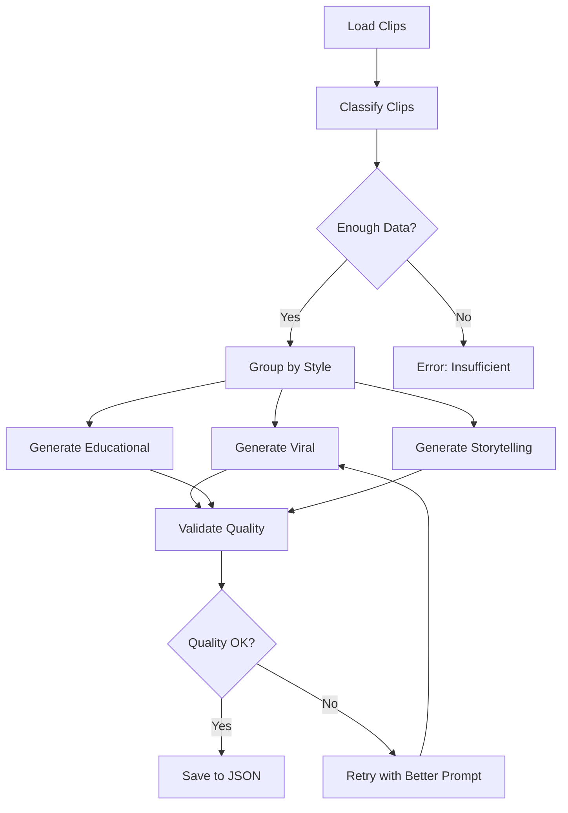

# CLIPER

**Transform long videos into viral clips automatically**

---

## What is CLIPER?

CLIPER is a CLI tool that automatically converts long YouTube videos into short, engaging clips perfect for TikTok, Instagram Reels, and YouTube Shorts. It uses AI to intelligently detect the best moments to cut.

### Features

- **Smart Download**: Download videos from YouTube with quality options
- **AI Transcription**: Convert audio to text with precise timestamps using WhisperX (local, no API)
- **Intelligent Clipping**: Detect optimal cut points using ClipsAI's TextTiling algorithm
- **AI Copy Generation**: Auto-generate viral captions with LangGraph + Google Gemini 2.0 (NEW!)
- **Social Media Ready**: Export clips in 9:16 format with embedded subtitles
- **Fast & Efficient**: Optimized for Apple Silicon (M1/M2/M3/M4)
- **Resume Capability**: Continue where you left off if interrupted
- **Beautiful CLI**: Professional interface with Rich library

---

## Installation

### Prerequisites

- **Python 3.9+** (required by WhisperX)
- **FFmpeg** (for video processing)
- **macOS/Linux** (tested on macOS, should work on Linux)

### Quick Install

```bash
# Clone the repository
git clone https://github.com/opino-tech/cliper.git
cd cliper

# Install dependencies with uv (recommended)
uv sync

# Or with pip
pip install -e .
```

### System Dependencies

```bash
# macOS (with Homebrew)
brew install ffmpeg libmagic

# Ubuntu/Debian
sudo apt-get install ffmpeg libmagic1
```

---

## Quick Start

```bash
# Run CLIPER
uv run cliper.py

# Or activate virtual environment first
source .venv/bin/activate
python cliper.py
```

### Basic Workflow

1. **Download**: Provide a YouTube URL → downloads video with yt-dlp
2. **Transcribe**: WhisperX converts audio to text (runs locally, no API needed)
3. **Generate Clips**: ClipsAI detects optimal cut points using semantic analysis
4. **Generate AI Copies**: LangGraph + Gemini auto-generates viral captions (requires API key)
5. **Export**: FFmpeg creates final clips in 9:16 format with embedded subtitles

---

## Docker Installation (Alternative)

If you prefer using Docker, CLIPER can run in a containerized environment without installing dependencies locally.

### Prerequisites

- **Docker**: [Install Docker](https://docs.docker.com/engine/install/)
- **Docker Compose**: [Install Docker Compose](https://docs.docker.com/compose/install/)

### Quick Start with Docker

```bash
# 1. Clone the repository
git clone https://github.com/opino-tech/cliper.git
cd cliper

# 2. Set your Google API key in docker-compose.yml
# Edit line 14 or create a .env file with:
# GOOGLE_API_KEY=your_gemini_api_key_here

# 3. Build the Docker image (first time only, takes 5-10 minutes)
docker-compose build

# 4. Run CLIPER
docker-compose run cliper

# 5. Or run specific commands
docker-compose run cliper uv run cliper.py --help
```

### Replicating CLIPER on Another PC

**Method 1: Using Docker Hub (Fastest)**

```bash
# On your machine - push image to Docker Hub
docker tag cliper_app <your-dockerhub-username>/cliper:latest
docker login
docker push <your-dockerhub-username>/cliper:latest

# On another PC - pull and run
docker pull <your-dockerhub-username>/cliper:latest
docker run -it --rm \
  -e GOOGLE_API_KEY="your_api_key_here" \
  -v $(pwd):/app \
  <your-dockerhub-username>/cliper:latest
```

**Method 2: Using Project Files**

```bash
# On another PC
git clone https://github.com/opino-tech/cliper.git
cd cliper

# Set your API key in docker-compose.yml
docker-compose build
docker-compose run cliper
```

### Docker Benefits

- ✅ **No local dependencies**: FFmpeg, Python, WhisperX all in container
- ✅ **Consistent environment**: Works the same on any machine
- ✅ **Persistent models**: WhisperX models cached in Docker volume
- ✅ **Easy sharing**: Push to Docker Hub, share with team

### GPU Support (Optional)

For faster transcription with NVIDIA GPUs:

```bash
# 1. Install NVIDIA Container Toolkit
# Follow: https://docs.nvidia.com/datacenter/cloud-native/container-toolkit/install-guide.html

# 2. Uncomment GPU lines in docker-compose.yml (lines 28-34)

# 3. Rebuild and run
docker-compose build
docker-compose run cliper
```

---

## Usage Examples

### Download and Process a Video

```bash
# Start CLIPER
uv run cliper.py

# Choose option 1: Download new video
# Enter YouTube URL when prompted
# Select transcription settings (model size, language)
# Choose clip generation method (AI detection or fixed time)
# Export clips with subtitles
```

### Process Existing Video

```bash
# If you already have a video in downloads/
# Choose option 1: Process a video
# Select from available videos
# Continue from where you left off
```

---

## Configuration

### Content Presets

CLIPER includes smart presets for different content types:

- **Livestream**: Optimized for long-form content with minimal topic changes
- **Podcast**: Perfect for multi-speaker content with topic transitions
- **Tutorial**: Ideal for structured educational content

### Environment Variables

Create a `.env` file for configuration:

```bash
# Copy the example file
cp .env.example .env

# Edit with your API keys
nano .env
```

**Required for AI Copy Generation:**
```env
# Google Gemini API Key (REQUIRED for AI copies)
# Get your free key at: https://aistudio.google.com/app/apikey
GOOGLE_API_KEY=your_gemini_api_key_here
```

**Optional settings:**
```env
# Whisper model size
WHISPER_MODEL=base

# Clip duration limits
MIN_CLIP_DURATION=30
MAX_CLIP_DURATION=90

# Gemini model for copy generation
GEMINI_MODEL=gemini-2.0-flash-exp
```

**How to get your Gemini API key:**
1. Visit [Google AI Studio](https://aistudio.google.com/app/apikey)
2. Sign in with your Google account
3. Click "Create API Key"
4. Copy the key and paste it in your `.env` file

---

## Architecture

```
URL → Download → Transcribe → Detect Clips → AI Copies → Export → Output
```

### Core Modules

- **`downloader.py`**: YouTube video download with yt-dlp
- **`transcriber.py`**: Audio-to-text conversion with WhisperX
- **`clips_generator.py`**: AI-powered clip detection with ClipsAI
- **`copys_generator.py`**: AI copy generation with LangGraph + Gemini (NEW!)
- **`video_exporter.py`**: Video cutting, resizing, and organization by style
- **`subtitle_generator.py`**: Subtitle generation and embedding

### Data Flow

```
downloads/           # Original videos
├── video.mp4

temp/                # Temporary processing files
├── video_id_transcript.json    # Raw transcription
├── video_id_clips.json          # Detected clips
└── video_id_audio.wav           # Extracted audio

output/              # Final output (ready to publish)
└── video_id/
    ├── copys/
    │   └── clips_copys.json     # AI-generated captions + metadata
    ├── 1.mp4                    # Clip 1 with subtitles
    ├── 1.srt                    # Subtitle file for clip 1
    ├── 2.mp4                    # Clip 2 with subtitles
    ├── 2.srt                    # Subtitle file for clip 2
    └── ...
```

**Note**: Simple numeric naming (1.mp4, 2.mp4) makes it easy to match clips with their AI-generated copies in `clips_copys.json`.

---

## How It Works

### 1. Transcription with WhisperX (Local, No API)

CLIPER uses **WhisperX**, an optimized version of OpenAI's Whisper that runs **100% locally** on your machine:

- **No API calls**: All transcription happens on your CPU/GPU
- **No costs**: Free, unlimited usage
- **Privacy**: Your audio never leaves your machine
- **Accuracy**: Word-level timestamps with forced alignment
- **Multi-language**: Auto-detects language or you can specify
- **Apple Silicon optimized**: Faster on M1/M2/M3/M4 chips

**How it works:**
1. Extracts audio from video with FFmpeg
2. Runs Whisper model locally (tiny/base/small/medium/large)
3. Aligns timestamps using wav2vec2 for precision
4. Outputs JSON with word-level timestamps

**No configuration needed** - just install and run!

---

### 2. Clip Detection with ClipsAI (Semantic Analysis)

CLIPER uses **ClipsAI**, a Python library that implements the **TextTiling algorithm** for semantic segmentation:

- **How it works**:
  1. Converts transcript to BERT embeddings (sentence transformers)
  2. Calculates semantic similarity between adjacent segments
  3. Detects "topic boundaries" where similarity drops
  4. Cuts clips at these natural transition points

- **Why it's smart**: Instead of cutting every 60 seconds, it cuts when the speaker **changes topics**
- **Fallback**: If content is too homogeneous (livestream Q&A), falls back to fixed-time cuts
- **Configurable**: Set min/max duration (default: 30-90s)

**No API needed** - runs locally using pre-trained BERT models.

---

### 3. AI Copy Generation with LangGraph + Gemini 2.0 (NEW)

This is the **only component that requires an API key**. It uses Google's Gemini 2.0 Flash to generate viral captions:

#### Architecture: 10-Node LangGraph Workflow



#### How it Works

**Phase 1: Classification** (1 API call)
- Analyzes all clips in batches of 10
- Detects optimal style per clip: `viral`, `educational`, or `storytelling`
- Uses transcript + duration to make decision

**Phase 2: Grouping**
- Groups clips by detected style
- Ensures balanced distribution

**Phase 3: Generation** (3 API calls, one per style)
- **Viral**: Short, punchy, curiosity-driven (e.g., "¿Sabías que...?")
- **Educational**: Informative, clear value prop
- **Storytelling**: Narrative hook, builds tension

**Phase 4: Quality Control**
- Validates engagement score > 7.5/10
- Ensures viral potential > 6.0/10
- Retries up to 2 times if quality is low
- **Graceful degradation**: Accepts 60%+ success rate (not all-or-nothing)

#### Output Format

```json
{
  "video_id": "AI_CDMX_Live_Stream_gjPVlCHU9OM",
  "generated_at": "2025-01-15T10:30:00",
  "model": "gemini-2.0-flash-exp",
  "total_clips": 14,
  "average_engagement": 8.2,
  "average_viral_potential": 7.5,
  "clips": [
    {
      "clip_id": 1,
      "copy": "¿Sabías que el 90% de developers usan React hooks mal? 🤯 #AICDMX #React",
      "metadata": {
        "sentiment": "curious_educational",
        "engagement_score": 8.5,
        "viral_potential": 7.8,
        "primary_topics": ["React", "hooks", "best practices"],
        "hook_strength": "high",
        "suggested_thumbnail_timestamp": 12.5
      }
    }
  ]
}
```

#### Key Features

- **Code-switching**: Spanish/English hybrid for tech LATAM audience
- **150-char limit**: Enforced with intelligent truncation (preserves #AICDMX)
- **Batch processing**: Handles 99+ clips efficiently
- **Rate limiting**: Automatic sleep between batches (no 429 errors)
- **Fault tolerance**: Continues even if individual batches fail

**API Cost**: ~$0.02 USD per video (99 clips) with Gemini 2.0 Flash

---

### 4. Export with FFmpeg (Video Processing)

- Cuts video segments at detected timestamps
- Resizes to 9:16 aspect ratio (vertical format)
- Generates SRT subtitles with word-level timing
- Embeds subtitles directly into video
- **Simple naming**: `1.mp4`, `2.mp4`, `3.mp4` (instead of verbose names)
- Maintains high quality with H.264 encoding

---

## Performance

**Tested on:** MacBook Pro M4, 99-minute livestream

```
Download:     3 minutes
Transcription: 25 minutes (medium model, CPU)
Clip Detection: 4 seconds
Export:       8 minutes (14 clips)
Total:        ~36 minutes

Output:
- 1,083 transcribed segments
- 52,691 characters
- 14 clips of 90s each
- Complete coverage of 99 minutes
```

**Bottleneck:** Transcription (70% of total time)

---

## Advanced Usage

### Custom Clip Generation

```python
from src.clips_generator import ClipsGenerator

generator = ClipsGenerator(
    min_clip_duration=60,
    max_clip_duration=120
)

clips = generator.generate_clips(
    transcript_path="temp/video_transcript.json",
    min_clips=5,
    max_clips=20
)
```

### Direct Transcription

```python
from src.transcriber import Transcriber

transcriber = Transcriber(model_size="base")
transcript_path = transcriber.transcribe(
    video_path="downloads/video.mp4",
    language="es"
)
```

---

## Troubleshooting

### Common Issues

**"No clips found"**
- Video may be too short or have no topic changes
- Try increasing `max_clip_duration`
- Use "fixed time" method as fallback

**"Transcription failed"**
- Check if FFmpeg is installed
- Verify video has audio track
- Try smaller Whisper model (`tiny`)

**"Import error"**
- Run from project root: `uv run cliper.py`
- Ensure virtual environment is activated
- Check all dependencies are installed

### Debug Mode

```bash
# Enable debug logging
export LOG_LEVEL=DEBUG
uv run cliper.py
```
### Development Setup

```bash
# Install development dependencies
uv sync --dev

# Run tests
uv run pytest

# Format code
uv run black src/
uv run isort src/
```

---

## License

This project is licensed under the MIT License - 

---

## Acknowledgments

- **WhisperX**: For precise audio transcription (runs locally)
- **ClipsAI**: For intelligent clip detection (semantic analysis)
- **Google Gemini 2.0**: For AI-powered copy generation
- **LangGraph**: For orchestrating multi-step AI workflows
- **Rich**: For beautiful CLI interface
- **yt-dlp**: For robust YouTube downloading
- **FFmpeg**: For video processing

---
